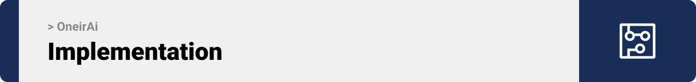

<br><br>

<!-- project philosophy -->


>Introducing OneirAi, a dream interpretation and visualization web app that utilizes the power of AI technology. This platform allows users to gain deeper insights into their subconscious mind by interpreting their dreams with personalized analysis and visualizations. In addition, it offers daily horoscopes, personality analysis, and compatibility tests all with the help of AI. 
>
> Our mission is to empower individuals to understand themselves better and to provide a unique and personalized experience for each user.

### User Stories
- As a user, I want to be able to enter details about my dream, so that I can get an AI-generated interpretation of my dream that offers insights into my subconscious thoughts.
- As a user, I want to be able to view a visual representation of my dream, so that I can explore and connect to my dream in a creative way.
- As a user, I want to be able to access my daily horoscope, receive a personality analysis and take a compatibility test using AI, so that I can see what the stars have in store for me each day, and gain valuable insights into my personality and compatibility with others.

### Admin Stories
- As an admin, I want to be able to view a list of all registered users on the platform, so that I can keep track of user activity and identify any potential issues or concerns.
- As an admin, I want to be able to generate bar charts, polar charts, line charts, and pie charts based on the data analysis of dream categories in each country, so that I can easily visualize the data and see what is the most common category in each country.
- As an admin, I want to be able to get count of all registered and subscribed users on the platform, so that I can track the growth of the website over time.


<br><br>

<!-- Prototyping -->


>I designed OneirAi using wireframes and mockups, iterating on the design until I reached the ideal layout for easy navigation and a seamless user experience.

### Wireframes


| Register Screen  | User Dashboard |  |
| ---| ---| ---|
|  |  | 

| Add Dream  | Interpret Dream |  |
| ---| ---| ---|
|  |  | 


### Mockups

> | Landing                                      | Signup/Signin/UserPanel                                                                                        |
> | ------------------------------------------------- | -------------------------------------------- |
> |  |  ! ! |
<!-- 
| Login screen  | SignUp Screen |  |
| ---| ---| ---|
|  |  |  -->

|| Add Dream |  Interpret Dream  |
| ---| ---| ---|
|  |  |  |
<details><summary>See more mockups</summary>

|| Interpret Dream |  Visualize Dream |
| ---| ---| ---|
|  |  |  |

|| Change Password | Edit Profile |
| ---| ---| ---|
|  |  |  |

|| Admin Panel |  View Registered Users |
| ---| ---| ---|
|  |  |  |

|| Pie Chart Analysis |  Bar Chart Analysis |
| ---| ---| ---|
|  |  |  |

<!-- || Landing Page  | Horoscope Page |  
| ---| ---| ---|
| |  |  |  -->

</details>
#

<br><br>


<!-- Implementation -->


> Using the wireframes and mockups as a guide, I implemented OneirAi app  with the following features:

### User Screens (Web)
|  | Landing Page |   |
| ---| ---| ---|
|  |  | |

|| Register |  Login |
| ---| ---| ---|
|  |  |  |

|| Add Dream |  Visualize Dream |
| ---| ---| ---|
|  |  |  |

|| Interpret & Download Dream |  Search, Sort & Delete |
| ---| ---| ---|
|  |  |  |

|| Edit Profile |  Change Password |
| ---| ---| ---|
|  |  |  |


|| Horoscope Page |  Daily Horoscope |
| ---| ---| ---|
|  |  |  |

|| Personality Analysis |  Compatibility Test |
| ---| ---| ---|
|  |  |  |


|| Admin Panel |  Data Analysis: Charts |
| ---| ---| ---|
|  |  |  |

|| Subscribe |  Reset Password |
| ---| ---| ---|
|  |  |  |

|| Permissions |  Responsiveness |
| ---| ---| ---|
|  |  |  |

<br><br>

<br><br>


<br><br>
<a id="implementation"></a>

<a id="tech-stack"></a>

Here's a brief high-level overview of the tech stack OneirAi app uses:
- This project uses the [Laravel framework](https://laravel.com/). Laravel is a web application framework with expressive, elegant syntax.
- As database, MySQL was used.
- OneirAi uses the [React](https://reactjs.org/) library for the front-end. React makes it painless to create interactive UIs, is component-based and is reusable.

<br><br>


> These are the instructions on setting up this project locally.
To get a local copy up and running follow these simple steps.

### Prerequisites

This is a list of things you need to use the software and how to install them.
* npm
  ```sh
  npm install npm@latest -g
  ```
* Apache, PHP, MySQL [Download](https://www.apachefriends.org/)
* Download composer   [Download](https://getcomposer.org/Composer-Setup.exe)

<a id="how-to-run"></a>

### Installation

1. Open your XAMPP control panel and start Apache and MySQL
2. Clone the repo 
```sh
   git clone https://github.com/sanarayess/OneirAi.git
```
  
3. Go into the back-end folder
```sh
   cd oneirai-backend
```
4. Rename the .env.example file to .env and specify your database name

5. Migrate the database schema
```sh
   php artisan migrate
```
6. Generate a secret key to handle token encryption 
```sh
   php artisan jwt:secret
```
7. Install the dependencies 
```sh
   composer install
```
8. Launch the server
```sh
   php artisan serve
```
9. Now to get the front-end up and running go into the front-end folder in a new terminal
```sh
   cd oneirai-frontend
```
10. Install the dependencies
   ```sh
   npm install
   ```
11. Rename .env.example to .env.local

12. Start the application
   ```sh
   npm start
   ```